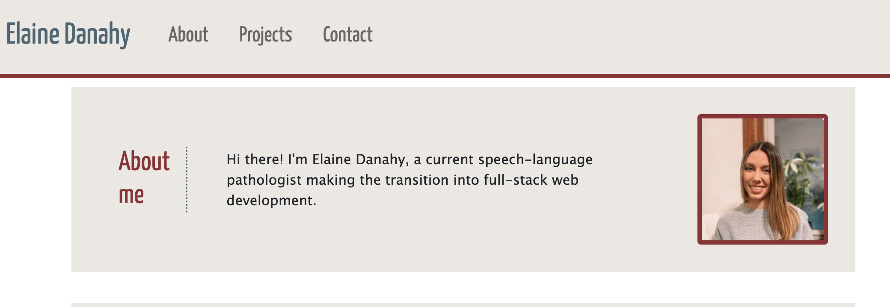
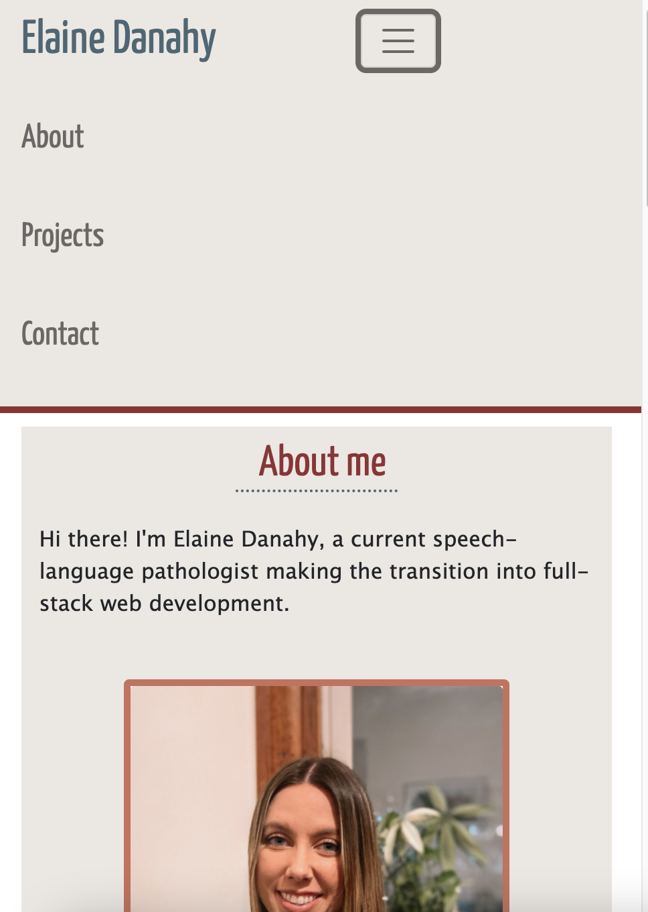
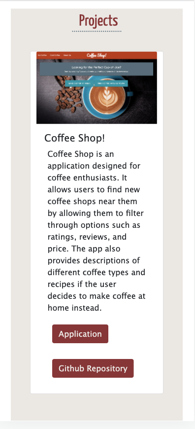
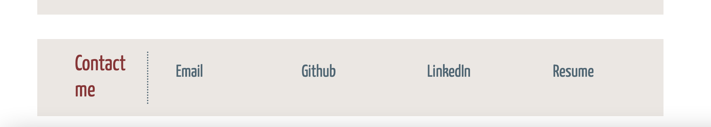

# elaineDanahy-portfolio
Welcome to my portfolio! Here is a landing page where I like to show off my latest projects.

## How it was made
This portfolio was developed using primarily HTML, CSS, and Bootstrap.

The viewer is provided both a picture and short description of me.

It has been made responsive to different screen sizes with the use of Bootstrap, Media Queries and FlexBox Features.

The links in the nav bar and contact section take the viewer to where they intend to go.

Screenshots and links to my project urls and repositories are provided. 

Lastly, the bottom of the page provides my contact information.

## URL Link
[Portfolio URL](https://edanahy22.github.io/elaineDanahy-portfolio/)

## Contact Information
email: edanahy22@gmail.com

## License
[MIT](https://choosealicense.com/licenses/mit/)

